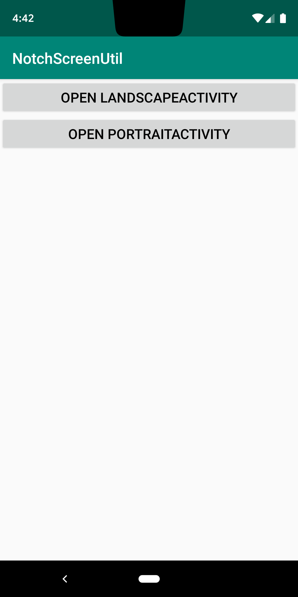
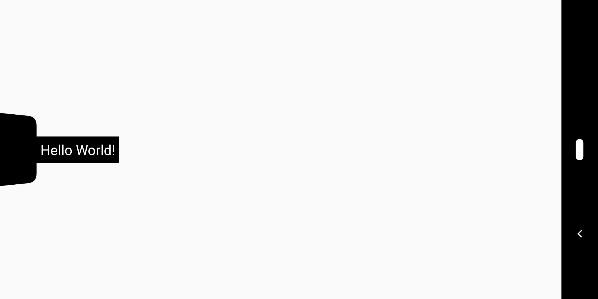

# NotchScreenTool 适配刘海屏水滴屏等全面屏工具

具体的适配过程可以查看这篇博客：

> [Android刘海屏、水滴屏全面屏适配方案](https://www.jianshu.com/p/2b8db60ba8df)

## 使用

1. 设置UI显示到刘海区域

        NotchScreenManager.getInstance().setDisplayInNotch(Activity activity);

    默认情况下，应用的界面不会绘制到刘海区域，调用此方法可允许绘制。

2. 获取刘海区域信息

        NotchScreenManager.getInstance().getNotchInfo(activity, new INotchScreen.NotchScreenCallback() {
            @Override
            public void onResult(INotchScreen.NotchScreenInfo notchScreenInfo) {
                Log.i(TAG, "Is this screen notch? " + notchScreenInfo.hasNotch);
                if (notchScreenInfo.hasNotch) {
                    for (Rect rect : notchScreenInfo.notchRects) {
                        Log.i(TAG, "notch screen Rect =  " + rect.toShortString());
                    }
                }
            }
        });
	其中，`INotchScreen.NotchScreenCallback`中的回调方法将会返回`NotchScreenInfo`，包括以下字段：
	
	|字段|类型|是否必填|描述
	|---|---|---|---|
	|hasNotch|boolean|是|是否是刘海屏
	|notchRects|List|否|屏幕刘海Rect的列表(屏幕可能有多个刘海) hasNotch属性为false时此字段为null

## 运行截图

MainActivity

{:height="50%" width="50%"}

横屏适配效果

竖屏适配效果

{:height="50%" width="50%"}

## License

	Licensed under the Apache License, Version 2.0 (the "License");
	you may not use this file except in compliance with the License.
	You may obtain a copy of the License at
	
	   http://www.apache.org/licenses/LICENSE-2.0
	
	Unless required by applicable law or agreed to in writing, software
	distributed under the License is distributed on an "AS IS" BASIS,
	WITHOUT WARRANTIES OR CONDITIONS OF ANY KIND, either express or implied.
	See the License for the specific language governing permissions and
	limitations under the License.